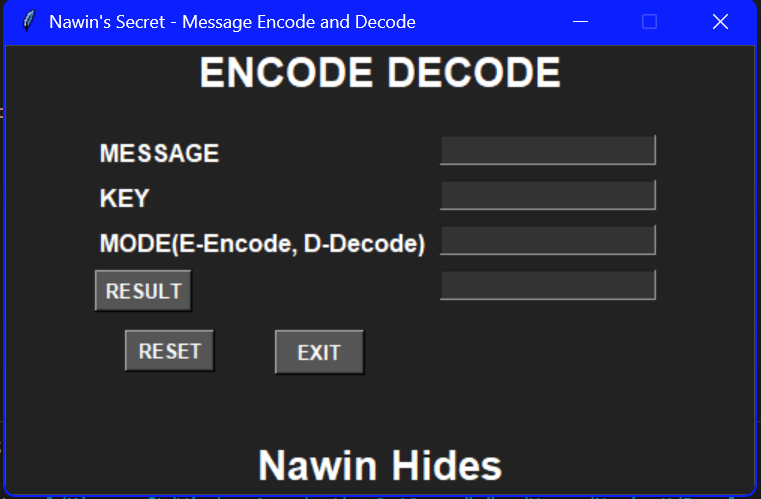

# Encryption
🔐🐍 Python Encryption Project 🚀

This Python Encryption Project is a versatile and user-friendly tool designed to provide robust encryption capabilities for securing sensitive data. Whether you're a cybersecurity enthusiast, a privacy-conscious individual, or a developer looking to integrate encryption features into your applications, this project has got you covered.

Key Features:
🛡️ Advanced Encryption Algorithms: Utilizes industry-standard encryption algorithms such as AES (Advanced Encryption Standard) and RSA (Rivest–Shamir–Adleman) to ensure data confidentiality.

📁 File Encryption: Seamlessly encrypt and decrypt files of various formats, safeguarding your important documents, images, and more.

📩 Text Encryption: Encrypt messages, passwords, or any sensitive textual data with ease.

🔐 Key Management: Implement secure key generation and management functionalities to maintain the integrity of your encryption process.

📜 Documentation & Examples: Clear and comprehensive documentation is provided, along with practical examples to help users understand and utilize the encryption library effortlessly.

## Usage

To use this encryption tool, follow these steps:

1. Clone the repository:
    ```sh
    git clone https://github.com/Nawin-Cyber-10/Message_Encryption_Simulator
    cd Message_Encryption_Simulator
    ```

2. Install the required dependencies:
    ```sh
    pip install -r requirements.txt
    ```

3. Run the application:
    ```sh
    python Encode Decode Dark.py
    python Encode Decode Light.py
    ```

4. Follow the on-screen instructions to encrypt or decrypt files and text.

## UI Screenshot



